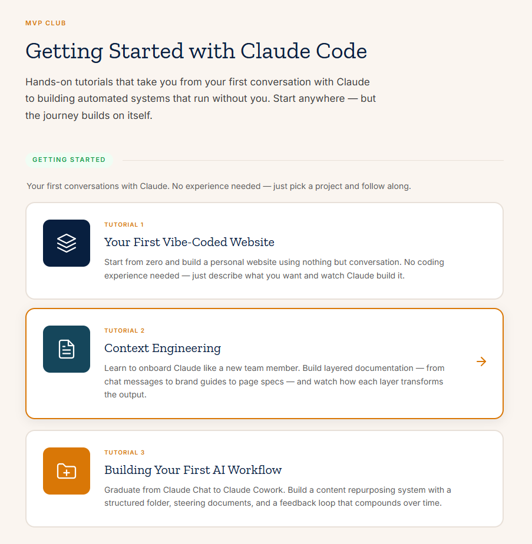

<p align="center">
  <a href="https://mvp-club-ai.github.io/getting-started-with-claude/">
    
  </a>
</p>

# Getting Started with Claude Code

**Hands-on tutorials that take you from your first conversation with Claude to building automated systems that run without you.**

<table align="center">
  <tr>
    <td align="center" width="360">
      <a href="https://mvp-club-ai.github.io/getting-started-with-claude/">
        
      </a>
      <br><br>
      <sub>All tutorials live on this deployed site. This repo is the source code.<br>Open the link above in your browser to get started.</sub>
    </td>
    <td width="380">
      <a href="https://mvp-club-ai.github.io/getting-started-with-claude/">
        
      </a>
    </td>
  </tr>
</table>

---

## How prompt-alongs work

These aren't articles to read. They're **procedural walkthroughs** you do side by side with Claude.

**Setup:** Open two windows next to each other:

1. **Left** — Claude Code (your terminal) or Claude Cowork (desktop app)
2. **Right** — The prompt-along in your browser

**Flow:** Each tutorial walks you step by step. When you hit a prompt block, copy it, paste it into Claude, and follow along with the results. You're building something real as you go — not watching a demo.

No coding experience required for the first tier. By the end, you're engineering automated pipelines.

---

## Tutorials

### Getting Started
| # | Tutorial | What you'll build |
|---|----------|-------------------|
| 1 | **Your First Vibe-Coded Website** | A personal website using nothing but conversation |
| 2 | **Context Engineering** | Layered documentation that transforms Claude's output |
| 3 | **Building Your First AI Workflow** | A content repurposing system with steering documents |

### The Three-Layer Model
| # | Tutorial | What you'll build |
|---|----------|-------------------|
| 4 | **The Three Layers of AI-Native Work** | A mental model for decomposing any task into data, execution, and intent |
| 5 | **Your Hard Drive Is a Database** | Directory maps and context indexes that make your files navigable |
| 6 | **The Execution Layer** | Persistent instructions, reusable skills, and state management |
| 7 | **Know What Good Looks Like** | Quality standards, verification scenarios, and three-lens evaluation |

### Advanced
| # | Tutorial | What you'll build |
|---|----------|-------------------|
| 8 | **From Workshop to Factory** | Automated pipelines with specs, non-interactive runs, and feedback loops |

## Structure

```
index.html              Homepage with tiered tutorial navigation
prompt-alongs/          Interactive tutorial pages
research/               Source research and system maps
assets/                 Images and visual assets
docs/                   Brand guides and planning documents
```

## Built with

Static HTML, CSS, and vanilla JS. No build step, no dependencies. Each tutorial is a single self-contained HTML file with inline styles and scripts, deployed via GitHub Pages.

---

<p align="center">
  <a href="https://mvp-club-ai.github.io/getting-started-with-claude/">
    <strong>mvp-club-ai.github.io/getting-started-with-claude</strong>
  </a>
  <br>
  Built by <a href="https://mvpclub.ai">MVP Club</a>
</p>
